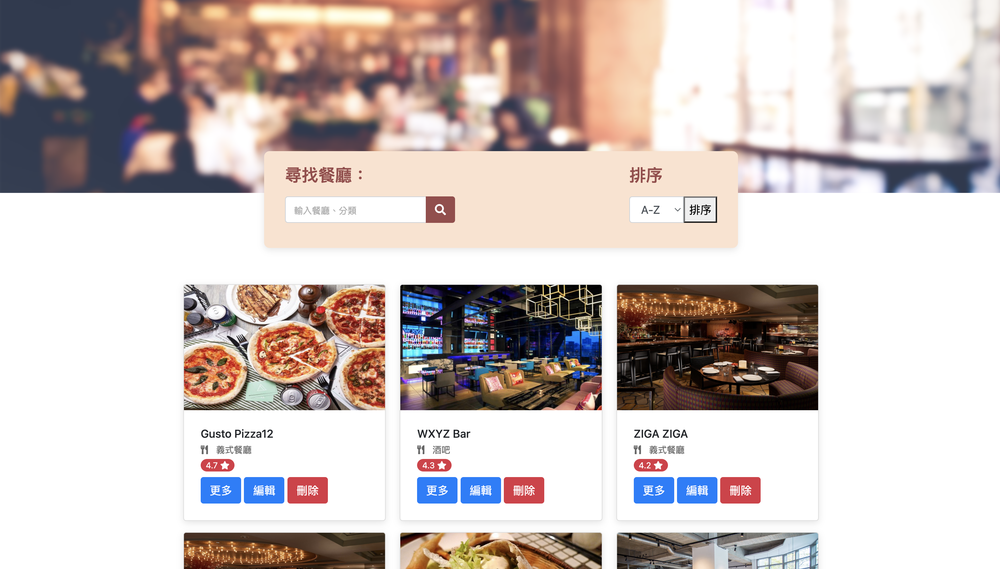

# Restaurant List

使用者可以在首頁註冊後登入看到所有餐廳與餐廳資料，並可以透過『新增』，增加喜愛的餐廳，『修改』調整喜愛餐廳的內容，『刪除』移除喜愛的餐廳。

## 專案功能

提供使用者登入後，查看餐廳列表，搜尋喜愛餐廳。

0. 登入：

- 以 Email 註冊
- 第三方登入(Facebook)

1. 直接呈現餐廳列表:

- 餐廳照片
- 餐廳名稱
- 餐廳分類
- 餐廳評分
- 首頁可以調整餐廳排序

2. 餐廳的詳細資訊:

- 類別
- 地址
- 電話
- 描述
- 圖片

3. 透過搜尋餐廳名稱來找到特定的餐廳
4. 透過搜尋餐廳類別來找到特定的餐廳
5. 透過『新增』，增加喜愛的餐廳
6. 透過『修改』，調整喜愛餐廳的內容
7. 透過『刪除』，移除喜愛的餐廳

## 環境建置與需求

- [Node.js@14.16.0][node]
- [Express.js@4.16.4][express]
- [nodemon][nodemon]
- [express-handlebars@3.0.0][exphbs]
- [mongoose@6.0.5][mongoose]
- [dotenv@16.0.1][dotenv]
- [method-override@3.0.0][method-override]
- [passport@0.4.1][passport]
- [passport-facebook@3.0.0][passport-facebook]
- [passport-local@1.0.0][passport-local]
- [bcryptjs@2.4.3][bcryptjs]
- [connect-flash@0.1.1][connect-flash]
- [express-session@1.17.1][express-session]

  [node]: https://nodejs.org/en/
  [nodemon]: https://www.npmjs.com/package/nodemon
  [express]: https://www.npmjs.com/package/express
  [exphbs]: https://www.npmjs.com/package/express-handlebars
  [mongoose]: https://www.npmjs.com/package//mongoose
  [dotenv]: https://www.npmjs.com/package/dotenv
  [method-override]: https://www.npmjs.com/package/method-override
  [passport]: https://www.npmjs.com/package/passport
  [passport-facebook]: https://www.npmjs.com/package/passport-facebook
  [passport-local]: https://www.npmjs.com/package/passport-local
  [bcryptjs]: https://www.npmjs.com/package/bcryptjs
  [connect-flash]: https://www.npmjs.com/package/connect-flash
  [express-session]: https://www.npmjs.com/package/express-session

## 安裝與執行步驟

1. 將檔案下載至本機
   `git clone git@github.com:Kris3131/restaurantList.git`

2. 進入到檔案資料夾中
   `cd restaurantList`

3. 安裝專案中所需 module
   `npm install`
4. 啟動 localhost server
   `npm run dev`
5. 資料庫串接
   - 建立`.env`檔案
   - 將 MONGO_URI 放進檔案中
6. 建立種子資料與資料庫連接
   `npm run seed`
7. User 種子 資料測試：

```json
  {
   "name": "user1",
   "email": "user1@example.com",
   "password": "12345678"
  },
  {
   "name": "user2",
   "email": "user2@example.com",
   "password": "12345678"
  }

```

## 專案畫面

1. 登入： 
2. 餐廳 新增 / 修改 / 刪除 
3. 排序： 
